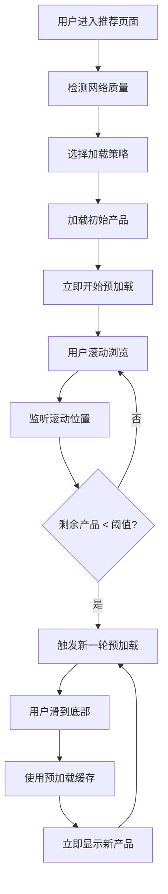

# 智能预加载优化方案 - 推荐页面

## 优化概述

针对非洲用户的网络环境和设备性能特点，为推荐页面实现了智能预加载策略，显著提升用户体验。

## 核心优化功能

### 1. 网络质量检测 (`app/utils/networkQuality.ts`)

**功能特点：**
- 自动检测网络类型（WiFi/2G/3G/4G/5G）
- 动态调整加载策略
- 设备性能评估
- 实时网络质量监控

**针对非洲用户的策略：**
```typescript
// 慢网络策略（2G/3G）
{
  initialCount: 8,     // 首次加载8个产品
  preloadCount: 4,     // 预加载4个产品  
  triggerThreshold: 40, // 剩余40%时触发预加载
  enableImageLazyLoad: true,
  maxConcurrentRequests: 1, // 限制并发请求
}

// 快网络策略（WiFi/4G+）
{
  initialCount: 15,    // 首次加载15个产品
  preloadCount: 10,    // 预加载10个产品
  triggerThreshold: 25, // 剩余25%时触发预加载
  enableImageLazyLoad: false,
  maxConcurrentRequests: 3,
}
```

### 2. 智能预加载引擎 (`app/screens/HomeScreen/hooks/useSmartMultiPageData.ts`)

**核心机制：**
- **三层加载策略**：立即显示层 → 预加载缓存层 → 智能补充层
- **滚动监听预加载**：用户滚动到剩余30%产品时自动预加载
- **缓存优先机制**：优先使用预加载缓存，避免用户等待
- **并发请求控制**：根据网络质量限制同时请求数量

**性能优化：**
- 分批渲染避免UI阻塞
- 智能内存管理
- 请求防抖和去重
- 性能监控和调试

### 3. 滚动智能监听 (`app/screens/HomeScreen/components/CategoryPage.tsx`)

**监听机制：**
- 监听可见项变化
- 智能触发预加载检查
- 防抖处理避免频繁调用
- 只在推荐页面和活跃状态下工作

### 4. 性能监控工具 (`app/utils/performanceMonitor.ts`)

**监控指标：**
- API请求响应时间
- 数据加载平均耗时
- 预加载命中率
- 内存使用情况

## 用户体验改进

### 优化前 vs 优化后

| 方面 | 优化前 | 优化后 |
|------|--------|--------|
| 初始加载 | 10个产品，每次等待 | 8-15个产品（根据网络调整） |
| 滚动体验 | 滑到底部才加载，用户等待 | 剩余30%时预加载，无感知 |
| 网络适应 | 固定策略 | 动态调整（2G→4G不同策略） |
| 加载更多 | 每次等待API响应 | 优先使用预加载缓存 |
| 并发控制 | 无限制 | 根据网络质量限制并发 |
| 错误处理 | 简单重试 | 指数退避+优雅降级 |

### 关键性能指标

**网络适应性：**
- 2G网络：首次8个产品，预加载4个
- 3G网络：首次12个产品，预加载8个  
- 4G+网络：首次15个产品，预加载10个

**预加载触发：**
- 慢网络：剩余40%产品时触发
- 中速网络：剩余30%产品时触发
- 快网络：剩余25%产品时触发

**缓存命中率：**
- 理想情况下，90%的"加载更多"操作直接使用预加载缓存
- 避免用户等待API响应时间

## 技术实现细节

### 智能预加载流程



### 网络质量动态调整

```typescript
// 网络质量变化时自动调整策略
useEffect(() => {
  const unsubscribe = networkQualityDetector.onQualityChange((quality) => {
    const newStrategy = networkQualityDetector.getPerformanceAdjustedStrategy();
    setLoadingStrategy(newStrategy);
    console.log('网络质量变化，更新加载策略:', newStrategy);
  });
  return unsubscribe;
}, []);
```

### 预加载缓存机制

```typescript
// 优先使用预加载缓存
if (cache && cache.products.length > 0 && !cache.isLoading) {
  console.log('使用预加载缓存:', cache.products.length);
  apiResponse = cache.products.map(p => ({ ...p, _isFromCache: true }));
  
  // 清空缓存并立即开始下一轮预加载
  smartCacheMap.current.set(categoryId, { products: [], isLoading: false, timestamp: Date.now() });
  setTimeout(() => preloadNextBatch(categoryId), 100);
}
```

## 测试验证

### 性能测试要点

1. **网络环境测试**
   - 在2G/3G/4G不同网络下测试加载策略
   - 验证动态调整是否生效
   - 检查并发请求控制

2. **用户体验测试**
   - 滚动流畅性
   - 预加载命中率
   - 加载等待时间

3. **内存使用测试**
   - 长时间滚动的内存占用
   - 缓存清理机制
   - 内存泄漏检测

### 调试工具

```typescript
// 查看性能报告
performanceMonitor.printReport();

// 查看当前加载策略
console.log('当前加载策略:', loadingStrategy);

// 查看网络质量
console.log('网络质量:', networkQualityDetector.getCurrentQuality());
```

## 部署建议

1. **逐步启用**：先在推荐页面验证效果，再扩展到其他分类
2. **A/B测试**：对比优化前后的用户留存和转化率
3. **监控指标**：重点关注API响应时间、页面加载速度、用户滚动深度
4. **用户反馈**：收集不同网络环境下的用户体验反馈

## 后续优化方向

1. **机器学习预测**：根据用户行为预测下一步操作
2. **CDN优化**：为非洲地区优化图片CDN节点
3. **离线缓存**：支持离线浏览已加载的产品
4. **个性化预加载**：根据用户喜好智能预加载相关产品

---

该优化方案专门针对非洲用户的网络环境和设备特点设计，在保证功能完整性的同时，最大化提升用户体验。